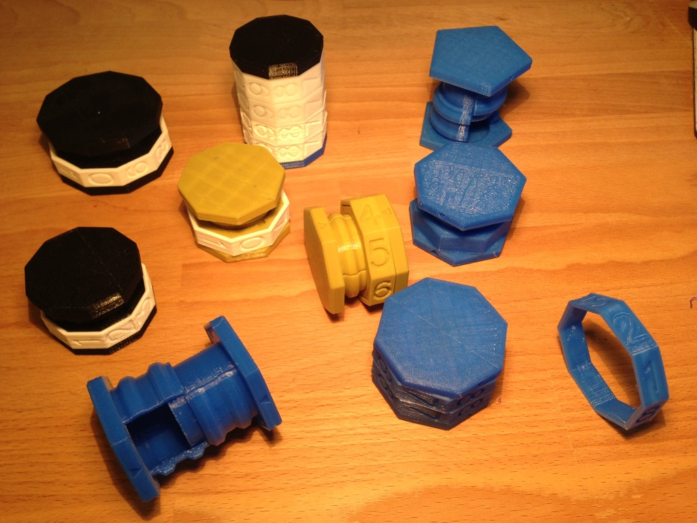
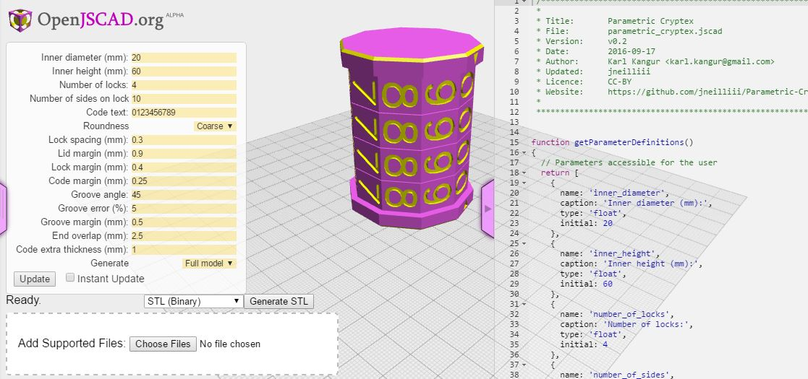

# Parametric Cryptex

The parametric [cryptex](https://www.wikiwand.com/en/Cryptex) is a parametric combination safe. Size, number of code rings and inscriptions on the code rings can be modified and `.stl` files can be generated to print the parts on a 3D printer.

It also allows to set the margins between movings parts, compensating for the printing inaccuracies of 3D printing, allowing to obtain a functional cryptex on any 3D printer. This was the main motivation behind the customizable cryptex, parts designed for one 3D printer might not be functional when printed on another one, the cryptex having lots of moving parts is especially affected by this issue.

The parametric cryptex is made of 4 parts: base, lid, code ring and lock ring. The number of code and lock rings depends on the settings.

More images under `/Images`.

## Parametrisation

The parametric cryptex is written in JavaScript for [OpenJSCAD](http://openjscad.org/), the `.stl` files can be generated with the same tool.

**[To open the Parametric Cryptex in the online OpenJSCAD preview click here](http://openjscad.org/#https://raw.githubusercontent.com/Nurgak/Parametric-Cryptex/master/parametric_cryptex.jscad)**

The easiest way to see the effects of changing a parameter is to try to [change them in the online OpenJSCAD tool](http://openjscad.org/#https://raw.githubusercontent.com/Nurgak/Parametric-Cryptex/master/parametric_cryptex.jscad). The customasable parameters are:

* Inner diameter: diameter of the inner space, this is useful for when the size item to be stored is known
* Inner height: height of the inner space
* Number of locks: how secure do you want your item to be?
* Number of sides on lock: enter 3 or more
* Code text: you may only use alphanumeric characters
* Roundness: this is mainly to accelerate the 3D generation process, it can be turned to _Corse_ when testing and _Fine_ when generating the `.stl` files
* Lock spacing: space between the lock rings
* Lid margin: margin between lid and the base
* Lock margin: margin between lock ring and the lid
* Code margin: margin between the lock ring and the code ring
* Groove angle: angle of the groove for the lid to slide in the base, 45 degrees is a good default value
* Groove error: it can be troublesome to open the lid if the groove angle inside the lock ring is the same as in the lid, the "error" makes the grooves inside the lock ring a bit larger (in proportion to the _Groove angle_ setting) so the code rings do not have to be _exactly_ aligned with the groove.
* Groove margin: margin between the base and lid for the groove, a large value makes the lid wobble inside the base
* Generate: generate different parts of the parametric cryptex so that the `.stl` files could be generated and printed separately

# Version log

## 0.1 (2016-02-01)

* Initial version

# License

This work is licensed under [Creative Commons Attribution 4.0 International License](http://creativecommons.org/licenses/by/4.0/).

